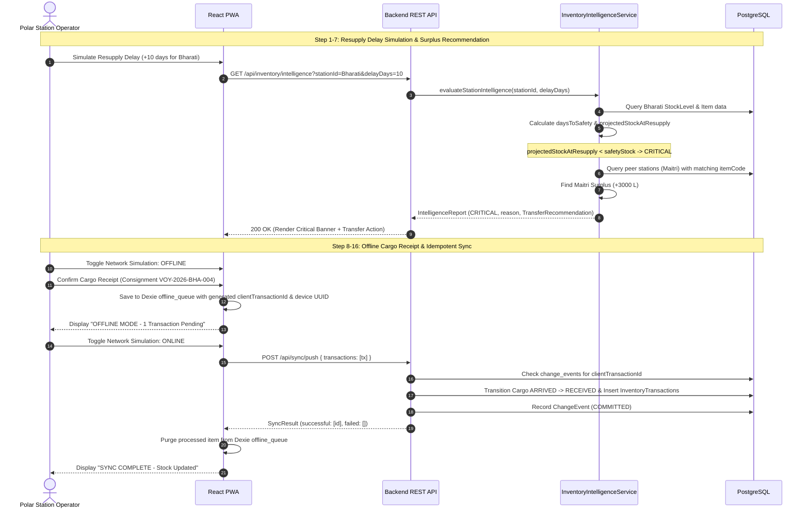

# High-Level Design (HLD) — Revised
## PolarOps — Integrated Polar Expedition Logistics & Asset Management System
**SIH 2026 — Problem Statement SIH26062 Prototype**

---

### 1. Problem Definition
Polar research stations (Maitri, Bharati, Himadri) operate in extreme, isolated Antarctic and Arctic environments where supply chains depend on seasonal voyages, air drops, and inter-station transfers. Weather delays or consumption surges can deplete life-critical stock (fuel, rations, medical, batteries). PolarOps integrates real-time inventory intelligence, cargo tracking, personnel movements, emergency response, and offline-first transactional synchronization into a cohesive, resilient platform.

---

### 2. Goals
- **Deterministic Inventory Intelligence**: Compute days-to-safety threshold breaches, projected stock at resupply, and inter-station transfer recommendations using explainable math with explicit edge-case handling (`currentStock <= safetyStock`, `dailyConsumption == 0`).
- **Separation of Item Master & Station Stock**: Maintain global `InventoryItem` (master catalogue) cleanly separated from station-specific `StockLevel`.
- **Atomic Cargo-to-Inventory Lifecycle**: Strict state-machine progression (`ARRIVED` $\rightarrow$ `RECEIVED`) executing within an atomic `@Transactional` boundary that creates inventory transactions and updates station stock levels.
- **Offline-First Resilience & Idempotent Sync**: Enable field personnel to execute local transactions on client-side IndexedDB with generated device UUIDs and `clientTransactionId` deduplication on `/api/sync/push`.
- **Lightweight Personnel & Emergency Domains**: Personnel tracking and SOS alert management directly integrated with station inventory/safety context.
- **Modular Monolith**: Single Spring Boot application and single React Vite PWA codebase, without microservice sprawl or artificial abstraction layers.

---

### 3. Non-Goals
- Multi-region distributed consensus protocols (e.g., Raft/Paxos).
- Event streaming brokers (Kafka/RabbitMQ) or caching layers (Redis).
- Complex microservice architectures, GraphQL, or vector/LLM search.
- Full OAuth2/OIDC identity provider implementation during the hackathon prototype (clean security boundary with header-based operator attribution).

---

### 4. System Context

```mermaid
flowchart TD
    subgraph Polar Station Client
        PWA["React PWA (Vite + Tailwind + Recharts + Leaflet)"]
        IDB[("IndexedDB (Dexie) - Local Store & Offline Queue")]
        PWA <--> IDB
    end

    subgraph PolarOps Backend (Modular Monolith - Spring Boot)
        API["REST Controllers (Thin Boundary)"]
        
        subgraph Core Services
            EXP["Expedition / Station Service"]
            INV["Inventory & Intelligence Service"]
            CARGO["Cargo Service"]
            SYNC["Sync Service (Idempotent Processor)"]
            PERS["Personnel Service (Lightweight)"]
            EMERG["Emergency Service (Lightweight)"]
        end

        API --> EXP
        API --> INV
        API --> CARGO
        API --> SYNC
        API --> PERS
        API --> EMERG
        
        CARGO -->|"Atomic Receive"| INV
        SYNC -->|"Replay Operations"| INV
        SYNC -->|"Replay Operations"| CARGO
    end

    subgraph Storage
        PG[("PostgreSQL Database")]
        EXP --> PG
        INV --> PG
        CARGO --> PG
        SYNC --> PG
        PERS --> PG
        EMERG --> PG
    end

    PWA -- "HTTPS / REST (Online)" --> API
    PWA -. "Batch Sync (Reconnected)" .-> API
```

---

### 5. Module Boundaries & Responsibilities

| Module | Core Responsibility | Invariants Protected |
|---|---|---|
| **`expedition`** | Station metadata (Maitri, Bharati, Himadri), geographic coordinates, operating status | Station codes are unique; coordinates are immutable |
| **`inventory`** | Item catalogue (`InventoryItem`), station stock levels (`StockLevel`), transactional ledger (`InventoryTransaction`), deterministic intelligence engine | Stock levels cannot be negative; stock mutations only occur via transactions |
| **`cargo`** | Consignment tracking, manifest items, voyage schedules, atomic receipt into stock | Receipt allowed **only** from `ARRIVED` $\rightarrow$ `RECEIVED`; receipts are idempotent and atomic |
| **`sync`** | Replay and deduplicate offline queue batches, audit logging (`ChangeEvent`) | Strict idempotency on `clientTransactionId`; records audit trail |
| **`personnel`** | Station roster, muster counts, field sorties | Personnel can only be checked into one station at a time |
| **`emergency`** | SOS broadcasts, geofence alerts with contextual safety inventory snapshot | Alert triggers attach immediate station life-support readiness status |

---

### 6. Data Flow & Demo Scenario



---

### 7. Database Overview
Separates global **`inventory_items`** (catalogue) from station-specific **`stock_levels`**. Schema is fully normalized with foreign keys and unique constraints.

---

### 8. Offline & Sync Architecture
1. **Client Storage**: Dexie (IndexedDB) stores station caches and `offline_queue`.
2. **Device Identity**: Client generates and persists a random UUID (`deviceId`) in `localStorage`.
3. **Idempotency**: Every client mutation receives a random `clientTransactionId` (UUID v4).
4. **Sync Gateway**: `SyncService` inspects `change_events` table for existing `clientTransactionId` before executing domain methods.

---

### 9. Deployment Architecture
- `docker-compose.yml` defining:
  - `postgres`: PostgreSQL 16 Alpine.
  - `backend`: Spring Boot 3.x (Java 21) executable JAR.
  - `frontend`: Vite React PWA served via Nginx with API reverse proxy.

---

### 10. Key Design Decisions
1. **Separation of Item Master & Stock Level**: Allows centralized item codes/names while enabling stations to have distinct consumption rates, safety buffers, and resupply cycles.
2. **No Generic Base Classes**: Concrete services and repositories for maximum readability and zero abstraction overhead.
3. **Record-Based DTOs**: DTOs grouped cohesively inside domain files (`InventoryDtos.java`, `CargoDtos.java`, etc.).
